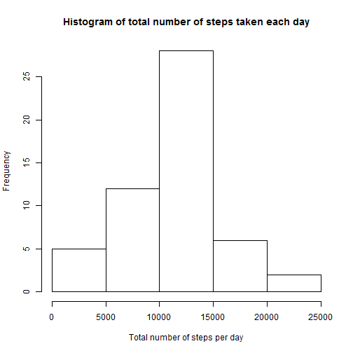
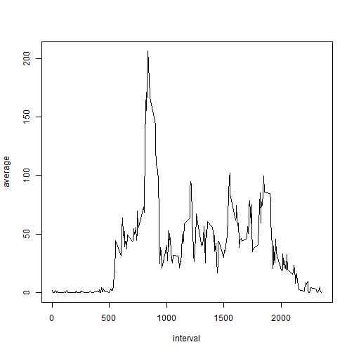
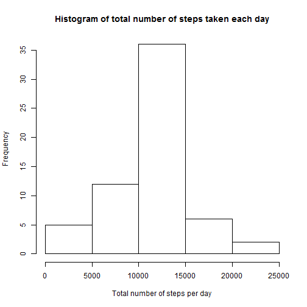
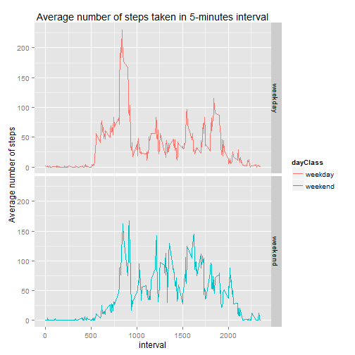

## Loading and preprocessing the data
To load and preprocess the data. The 'interval' and 'steps' variables are loaded as integer while the 'date' variable is loaded as Date


```r
library(dplyr)
library(ggplot2)

df <- read.csv(file = "activity.csv", stringsAsFactors = FALSE, na.strings = "NA", colClasses = c("integer", "Date", "integer"))
```


## What is mean total number of steps taken per day?
Histogram of the total number of steps taken per day

```r
summaryDF <- df %>% group_by(date) %>% summarise(total = sum(steps))

hist(summaryDF$total, xlab = "Total number of steps per day", main = "Histogram of total number of steps taken each day")
```

 

The mean and median total number of steps taken per day

```r
summary(summaryDF$total)
```

```
##    Min. 1st Qu.  Median    Mean 3rd Qu.    Max.    NA's 
##      41    8841   10760   10770   13290   21190       8
```


## What is the average daily activity pattern?
A time series plot of the 5-minute interval and the average number of steps taken, averaged across all days.

```r
activityPattern <- df %>% filter(!is.na(steps)) %>% group_by(interval) %>% summarize(average = mean(steps))

plot(activityPattern, type = "l")
```

 

The 5-minute interval contains the maximum number of steps is

```r
activityPattern[which.max(activityPattern$average),]
```

```
## Source: local data frame [1 x 2]
## 
##   interval  average
##      (int)    (dbl)
## 1      835 206.1698
```


## Imputing missing values
The number of missing values in the variable 'steps' in the dataset

```r
sum(is.na(df$steps))
```

```
## [1] 2304
```

Fill the missing values using the average value across all days on the same 5-minute interval

```r
merged <- merge(df, activityPattern, by = "interval")
merged$steps <- ifelse(is.na(merged$steps), round(merged$average), merged$steps)
```

Histogram of the total number of steps taken per day

```r
summaryMerged <- merged %>% group_by(date) %>% summarize(total = sum(steps))

hist(summaryMerged$total, xlab = "Total number of steps per day", main = "Histogram of total number of steps taken each day")
```

 

The mean and median total number of steps taken per day

```r
summary(summaryMerged$total)
```

```
##    Min. 1st Qu.  Median    Mean 3rd Qu.    Max. 
##      41    9819   10760   10770   12810   21190
```

The histogram of the dataset with missing values filled in is similar in shape and values as the histogram of the original dataset.

## Are there differences in activity patterns between weekdays and weekends?
Create a new factor variable called 'dayClass' that classify the day as either a weekday or weekend

```r
merged$dayClass <- ifelse(weekdays(merged$date) == "Saturday" | weekdays(merged$date) == "Sunday", "weekend", "weekday")
merged$dayClass <- as.factor(merged$dayClass)
```

A panel plot of a time series plot of the 5-minute interval and the average number of steps taken, averaged across all weekday days or weekend days.

```r
activityPattern2 <- merged %>% group_by(interval, dayClass) %>% summarize(average = mean(steps))

g <- ggplot(activityPattern2, aes(interval, average))
g + geom_line(aes(color = dayClass)) + facet_grid(dayClass ~ .) + ylab("Average number of steps") + ggtitle("Average number of steps taken in 5-minutes interval")
```

 

